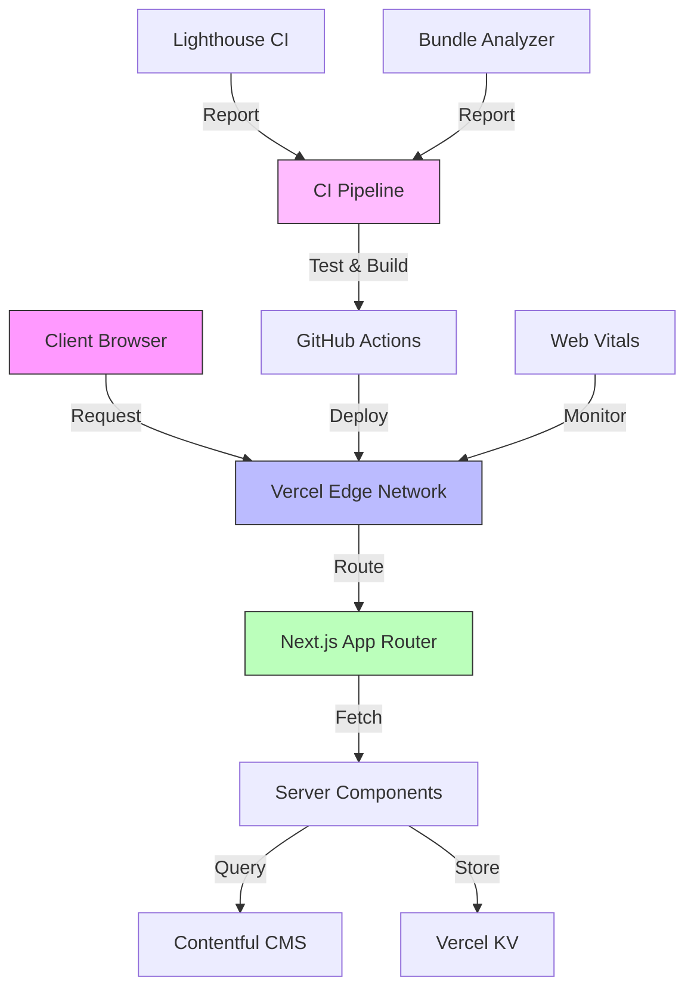
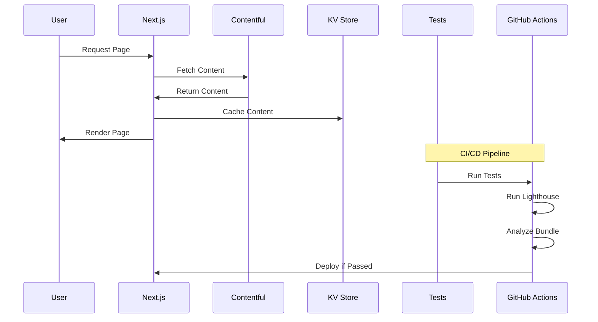

# Architecture for Professional Portfolio Website

## Status: Approved

## Technical Summary

This architecture defines a modern, performant, and accessible portfolio website built with Next.js and TypeScript. The system employs the latest web technologies and best practices to ensure excellent user experience, maintainability, and developer productivity. The architecture is designed to support a 6-8 week development timeline while maintaining high quality and performance standards.

## Technology Table

| Technology                   | Description                                                                            |
| ---------------------------- | -------------------------------------------------------------------------------------- |
| Next.js 15.1.7               | Latest React framework with App Router, React 19 support, and improved error debugging |
| React 19                     | Latest stable React version with sibling pre-warming and enhanced performance          |
| TypeScript                   | Type-safe JavaScript superset for improved developer experience                        |
| Tailwind CSS 4               | Latest CSS-first framework with high-performance engine and modern CSS features        |
| Contentful                   | Headless CMS for content management                                                    |
| Jest & React Testing Library | Testing frameworks for unit and integration tests                                      |
| Playwright                   | End-to-end testing, accessibility testing, and visual regression testing               |
| GitHub Actions               | CI/CD pipeline automation                                                              |
| Vercel                       | Hosting and deployment platform                                                        |
| i18next                      | Internationalization framework                                                         |
| Web Vitals                   | Performance monitoring                                                                 |
| Three.js                     | 3D graphics and animations                                                             |
| Storybook                    | Component documentation and testing                                                    |
| Lighthouse CI                | Automated performance and accessibility testing                                        |
| Bundle Analyzer              | Webpack bundle size analysis                                                           |

## Architectural Diagrams





## Project Structure

```bash
/
├── app/                    # Next.js app directory
│   ├── [locale]/          # i18n routes
│   │   ├── page.tsx       # Home page
│   │   ├── about/        # About section
│   │   ├── projects/     # Projects section
│   │   ├── work/         # Work section
│   │   └── contact/      # Contact section
│   ├── api/               # API routes
│   └── components/        # React components
│       ├── ui/           # Base UI components
│       ├── features/     # Feature components
│       └── widgets/      # Widgets (performance, accessibility)
├── content/               # Static content
├── lib/                   # Utility functions
│   ├── cms/              # CMS integration
│   ├── analytics/        # Analytics setup
│   └── testing/          # Test utilities
├── public/               # Static assets
├── styles/               # Global styles
├── tests/                # Test files
│   ├── unit/            # Jest & RTL tests
│   ├── integration/     # Jest & RTL tests
│   └── e2e/             # Playwright tests and configs
│       ├── specs/       # Test specifications
│       ├── fixtures/    # Test data and fixtures
│       └── utils/       # Test utilities and helpers
├── playwright/           # Playwright configuration and utilities
│   ├── config/          # Test environment configs
│   └── reports/         # Test reports and screenshots
├── .github/              # GitHub Actions
│   └── workflows/        # CI/CD workflows
└── docs/                 # Documentation
    ├── components/       # Component docs
    └── testing/         # Testing docs
```
