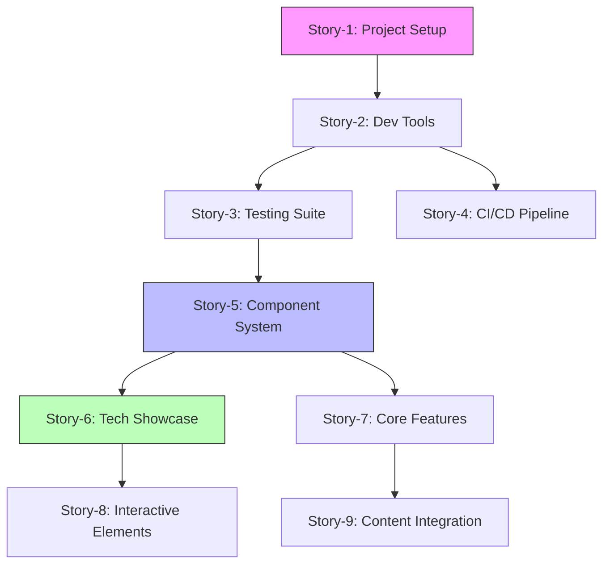

# Product Requirements Document (PRD) for Professional Portfolio Website

## Status: Draft

## 1. Introduction

This PRD outlines the implementation of a modern, professional portfolio website that showcases developer skills, projects, and technical expertise. The website will be built with a focus on performance, accessibility, and internationalization, demonstrating best practices in modern web development.

### Target Users

1. **Primary**
   - Technical recruiters and hiring managers
   - Potential clients seeking development services
   - Fellow developers interested in technical implementations

2. **Secondary**
   - Open source community members
   - Technical blog readers
   - Students and learners

### Stakeholders

- Project owner (portfolio owner)
- Development team
- Design collaborators
- Content creators

## 2. Goals and KPIs

Each goal is associated with specific, measurable KPIs:

1. Create a visually appealing and professional portfolio website
   - User engagement: Average session duration > 3 minutes
   - Bounce rate < 40%
   - Return visitor rate > 25%

2. Showcase technical expertise through implementation of advanced features
   - Feature adoption rate > 60% (dark mode, language switching)
   - Interactive element engagement > 40%
   - Average time spent on project cases > 2 minutes

3. Achieve perfect Lighthouse scores
   - Performance score > 95
   - Accessibility score > 95
   - Best Practices score > 95
   - SEO score > 95
   - First Contentful Paint < 1.2s
   - Time to Interactive < 2.0s

4. Demonstrate modern web development best practices
   - Code coverage > 90%
   - Zero critical security vulnerabilities
   - Zero accessibility violations
   - Successful CI/CD builds > 95%

5. Create a maintainable and well-documented codebase
   - Documentation coverage > 90%
   - Component reuse rate > 70%
   - Code maintainability index > 85

6. Complete the project within 6-8 weeks timeline
   - Sprint velocity variance < 20%
   - Story completion rate > 85%
   - Bug escape rate < 10%

## 3. Features and Requirements

### Functional Requirements

- Homepage with interactive 3D elements and animations
  - Three.js powered interactive background
  - GSAP animations for smooth transitions
  - Performance-optimized 3D rendering

- Technical Showcase Components
  - Performance and accessibility widget (movable, real-time metrics)
  - Interactive code snippets with syntax highlighting
  - Live demo integrations
  - Technical stack visualization
  - Real-time performance metrics display

- Projects Section
  - Dynamic content loading with SSR/ISR capabilities
  - Interactive case studies with technical deep-dives
  - Live demo environments
  - Code snippet showcases
  - GitHub integration for live repository stats

- Advanced Features Showcase
  - Basic multi-language support (i18n)
  - Theme system with custom color scheme generation
  - Real-time data updates via Supabase subscriptions

- Developer Experience Features
  - Component playground (Storybook)
  - Performance monitoring dashboard
  - Accessibility testing suite
  - Interactive technical documentation

- Testing & CI/CD Showcase
  - End-to-end test results display
  - Real-time CI/CD pipeline status
  - Code coverage metrics
  - Performance regression tracking
  - Security scan results

### Widget Implementation Details

1. **Core Functionality**
   - Draggable interface with smooth movement
   - Position snapping to screen corners
   - Position persistence across sessions
   - Responsive design with mobile optimization
   - Keyboard navigation support
   - Screen reader compatibility

2. **Display Metrics**

   ```typescript
   interface WidgetMetrics {
     testCoverage: number;
     bundleSize: string;
     lighthouse: {
       performance: number;
       accessibility: number;
       seo: number;
       bestPractices: number;
     };
     webVitals: {
       lcp: number;
       fid: number;
       cls: number;
     };
   }
   ```

3. **Widget Features**
   - Minimize/Expand functionality
   - Real-time metric updates
   - Custom animations for state changes
   - Error state handling
   - Loading state indicators

4. **Implementation Example**

   ```tsx
   const MetricsWidget: React.FC<WidgetProps> = ({ metrics, position }) => {
     const [isMinimized, setIsMinimized] = useState(false);
     const [currentPosition, setPosition] = usePersistedState('widget-position', position);

     return (
       <Draggable
         position={currentPosition}
         onStop={handleDragStop}
         bounds="parent"
         handle=".widget-handle"
       >
         <div className={cn('metrics-widget', { minimized: isMinimized })}
              role="region"
              aria-label="Performance Metrics">
           {/* Widget content */}
         </div>
       </Draggable>
     );
   };
   ```

### Deployment Strategy

1. **Environment Setup**
   - Development environment
   - Staging environment
   - Production environment
   - Environment-specific configurations

2. **Deployment Process**
   - Vercel deployment configuration
   - Custom domain setup
   - SSL/TLS configuration
   - CDN configuration

3. **Post-Deployment**
   - Automated smoke tests
   - Manual verification checklist
   - DNS propagation verification
   - SSL certificate verification

4. **Monitoring**
   - Uptime monitoring
   - Error tracking
   - Performance monitoring
   - Usage analytics

### Project Timeline

1. **Week 1-2: Setup & Infrastructure**
   - Project initialization
   - Development environment setup
   - CI/CD pipeline configuration
   - Basic component structure

2. **Week 3-4: Core Features**
   - Homepage implementation
   - Project showcase development
   - Basic animations
   - Metrics widget development

3. **Week 5-6: Advanced Features**
   - Technical showcases
   - Testing implementation
   - Performance optimization
   - Documentation

4. **Week 7-8: Polish & Launch**
   - Final testing
   - Content refinement
   - Performance optimization
   - Deployment & monitoring

### Tools & Versions

1. **Core Technologies**
   - Next.js 15.1.7
   - React 19
   - TypeScript 5.4
   - Node.js 20.x LTS

2. **UI & Styling**
   - Tailwind CSS 4
   - GSAP 3.12
   - Three.js 0.160.0
   - Framer Motion 11.x

3. **Testing & Quality**
   - Jest 29.x
   - React Testing Library 14.x
   - Playwright 1.41
   - ESLint 8.x
   - Prettier 3.x

4. **Infrastructure (Free Tiers)**
   - Vercel (Hobby)
     - 100GB Bandwidth/month
     - Automatic HTTPS
     - CI/CD included
   - Supabase
     - 500MB database
     - 50K MAU
     - 1GB file storage
   - GitHub Actions
     - 2000 minutes/month
     - Unlimited public repositories

5. **Fallback Options**
   - Netlify (Alternative to Vercel)
   - PostgreSQL (Self-hosted alternative to Supabase)
   - GitLab CI (Alternative to GitHub Actions)

### Non-functional Requirements

- Lighthouse score of 95+ in all categories
- Page load time under 2 seconds
- WCAG 2.1 Level AA compliance
- 100% test coverage
- Automated CI/CD pipeline with GitHub Actions (free tier)
- SEO optimization
- Basic analytics integration (free tier)
- Public GitHub repository with badges

### Compliance Requirements

1. **Accessibility**
   - WCAG 2.1 Level AA compliance
   - ARIA landmarks and roles implementation
   - Keyboard navigation support
   - Screen reader compatibility
   - Color contrast ratios meeting WCAG standards

2. **Privacy & Data**
   - GDPR compliance for contact form
   - Cookie consent implementation
   - Privacy policy documentation
   - Data retention policy
   - Secure data transmission (HTTPS)

3. **Performance**
   - Core Web Vitals compliance
   - Mobile-first responsive design
   - Progressive enhancement
   - Offline capability (PWA)

4. **Security**
   - OWASP Top 10 compliance
   - Content Security Policy (CSP)
   - Regular security audits
   - Secure form handling
   - XSS protection

### Cost Optimization Strategy

1. **Infrastructure**
   - Vercel hosting (free tier)
   - GitHub free tier for repository and Actions
   - Cloudflare for CDN and DNS (free tier)
   - Supabase (free tier) for:
     - App data and analytics
     - Contact form handling
     - User preferences storage
     - Real-time features
     - Authentication (if needed)
   - Contentful (free tier) for:
     - Content management
     - Translations/i18n
     - Case studies and project details
     - Rich text editing
     - Content versioning

2. **Development Tools**
   - Open-source packages and libraries
   - Supabase client SDK
   - Contentful SDK and CLI
   - Minimal external service dependencies

3. **Content Management**
   - Contentful for structured content:
     - 25,000 records
     - 48 Content Types
     - 2 locales
     - 5 user seats
   - Supabase for application data:
     - 500MB database
     - Real-time subscriptions
     - Database backups

### Content Architecture

1. **Contentful Models**

   ```typescript
   interface ProjectContent {
     title: LocalizedString;
     description: LocalizedString;
     technicalDetails: RichText;
     showcase: {
       images: Asset[];
       demoUrl?: string;
       githubUrl?: string;
     };
     implementation: RichText;
     techStack: string[];
   }

   interface CaseStudy {
     title: LocalizedString;
     summary: LocalizedString;
     challenge: RichText;
     solution: RichText;
     results: RichText;
     technologies: string[];
     timeline: string;
   }
   ```

2. **Supabase Schema**

   ```sql
   -- User preferences
   create table public.user_preferences (
     id uuid references auth.users,
     theme text,
     widget_position jsonb,
     created_at timestamptz default now(),
     updated_at timestamptz default now()
   );

   -- Analytics events
   create table public.analytics_events (
     id uuid default uuid_generate_v4(),
     event_type text,
     event_data jsonb,
     created_at timestamptz default now()
   );
   ```

## 4. Epic Structure

Epic-1: Core Infrastructure & Developer Experience

- Setup Next.js 15.1.7 with React 19 and TypeScript
- Establish comprehensive testing infrastructure
- Configure advanced ESLint and Prettier
- Setup Supabase integration with type safety
- Implement advanced CI/CD pipeline
- Configure development tooling (Husky, commit hooks)

Epic-2: Design System & Component Architecture

- Implement Tailwind CSS 4 with custom configuration
- Create advanced component system with accessibility
- Setup Storybook with interactive documentation
- Implement theme system with color scheme generation
- Create reusable animation system
- Build technical component showcase

Epic-3: Content & Data Architecture

- Setup Contentful integration
- Create content models and migrations
- Implement preview environments
- Setup Supabase tables and policies
- Build content fetching layer
- Implement caching strategy

Epic-4: Technical Feature Showcase

- Implement 3D background with Three.js
- Create performance/accessibility widget
- Setup i18n with Contentful
- Build real-time features with Supabase
- Create technical stack visualization
- Implement demo environments

Epic-5: Polish & Launch

- Build interactive case studies
- Create technical deep-dives
- Setup GitHub integration
- Create performance dashboard
- Build accessibility testing suite
- Final optimizations

## 5. Story List

### Story Dependencies



Epic-1: Core Infrastructure & Developer Experience

Story-1: Advanced Project Setup

- Initialize Next.js 15.1.7 with TypeScript
- Configure path aliases and module resolution
- Setup environment management
- Initialize Supabase client with types

Story-2: Developer Tooling

- Configure ESLint with custom rules
- Setup Prettier with tailored config
- Implement Git hooks with Husky
- Create comprehensive documentation structure

Story-3: Testing Infrastructure

- Setup Jest with custom matchers
- Configure React Testing Library
- Setup Playwright for E2E
- Implement visual regression testing
- Create test utilities and helpers

Story-4: CI/CD Excellence

- Configure GitHub Actions with matrix testing
- Setup deployment environments
- Implement automated quality gates
- Configure performance budgets

Epic-2: Design System & Component Architecture

Story-5: Advanced Component System

- Create atomic design structure
- Implement compound components
- Setup advanced hooks system
- Create accessibility utilities

Story-6: Technical Showcase Components

- Build performance widget
- Create code playground
- Implement technical documentation
- Setup demo environment

Story-7: Animation & Interaction

- Setup GSAP integration
- Create reusable animation system
- Implement 3D background
- Build interaction utilities

Story-8: Theme System

- Implement dynamic theme generation
- Create color system with P3 colors
- Setup container queries
- Build responsive utilities

Epic-3: Content & Data Architecture

Story-9: Advanced Features

- Implement i18n system
- Create PWA capabilities
- Setup real-time features
- Build API playground

[Additional stories will be detailed when subsequent Epics become current]

## 6. Future Enhancements

- Interactive project demos
- Integration with GitHub API
- Newsletter subscription
- Automated blog post social sharing
- Portfolio analytics dashboard
- Additional language support
- AI-powered features (chatbot, text generator)

## 7. Essential Metrics

### Core Metrics

- Page load performance (Lighthouse score > 95)
- Accessibility compliance (WCAG 2.1 Level AA)
- Mobile responsiveness (100% functional on major devices)
- SEO baseline (Lighthouse score > 95)

### User Engagement

- Time spent on project showcases
- Contact form submissions
- Project case study views
- Downloads (if offering resources)

## 8. Measurement Implementation

### Analytics Setup

1. **Cost-Effective Analytics Stack**
   - Vercel Analytics (included in free tier)
   - Custom analytics with Supabase (free tier includes):
     - Database: 500MB
     - Auth: 50K monthly active users
     - Edge Functions: 500K invocations
     - File storage: 1GB
   - Lighthouse CI (free, runs in GitHub Actions)

2. **Key Measurements**
   - Built-in Vercel performance monitoring
   - Custom analytics dashboard using Supabase
   - Lighthouse automated scoring
   - Real-time form submission tracking

### Reporting

- Automated Lighthouse reports on deployments
- Monthly manual performance review
- Quarterly content effectiveness review
- Cost monitoring and optimization review

### Privacy First

- Data stored in Supabase (GDPR compliant)
- No third-party tracking scripts
- Minimal data collection
- Row-level security policies
- Data encryption at rest

### Cost Control

- Monitor free tier usage limits
- Optimize asset sizes and caching
- Implement lazy loading strategies
- Use static generation where possible
- Minimize external service dependencies

### Technical Implementation Highlights

1. **Frontend Excellence**
   - Next.js 15.1.7 with React 19 features showcase
   - Advanced CSS features (container queries, P3 colors)
   - Custom hooks and utilities showcase
   - Performance optimization techniques
   - Advanced animation patterns

2. **State Management**
   - Server and client state separation
   - Real-time subscriptions
   - Optimistic updates
   - Cache management strategies

3. **Testing Approach**
   - Unit tests (Jest + RTL)
   - Integration tests
   - E2E tests (Playwright)
   - Visual regression testing
   - Accessibility testing
   - Performance testing

4. **Developer Tools**
   - Advanced ESLint configuration
   - Custom Prettier rules
   - Git hooks (Husky)
   - Advanced TypeScript patterns
   - Documentation generation

### Testing Implementation

1. **Unit Testing Strategy**

   ```typescript
   // Component Test Example
   describe('MetricsWidget', () => {
     it('renders with correct metrics', () => {
       const metrics = {
         testCoverage: 95,
         bundleSize: '120KB',
         lighthouse: {
           performance: 98,
           accessibility: 100
         }
       };
       
       render(<MetricsWidget metrics={metrics} />);
       expect(screen.getByText('95%')).toBeInTheDocument();
     });

     it('handles drag and snap functionality', () => {
       // Test drag behavior
     });
   });

   // Hook Test Example
   describe('usePersistedState', () => {
     it('persists state across renders', () => {
       // Test state persistence
     });
   });
   ```

2. **Integration Testing**

   ```typescript
   describe('Project Showcase Integration', () => {
     it('loads and displays project data', async () => {
       render(<ProjectShowcase />);
       await waitFor(() => {
         expect(screen.getByText('Project Title')).toBeInTheDocument();
       });
     });

     it('handles theme switching', async () => {
       // Test theme integration
     });
   });
   ```

3. **E2E Testing with Playwright**

   ```typescript
   test('complete portfolio navigation', async ({ page }) => {
     await page.goto('/');
     
     // Test navigation
     await page.click('nav >> text=Projects');
     await expect(page).toHaveURL('/projects');
     
     // Test interactions
     await page.click('.project-card:first-child');
     await expect(page.locator('.project-details')).toBeVisible();
     
     // Test responsive behavior
     await page.setViewportSize({ width: 375, height: 667 });
     await expect(page.locator('.mobile-menu')).toBeVisible();
   });
   ```

4. **GitHub Actions Workflow**

   ```yaml
   name: Test & Deploy
   
   on:
     push:
       branches: [main]
     pull_request:
       branches: [main]
   
   jobs:
     test:
       runs-on: ubuntu-latest
       steps:
         - uses: actions/checkout@v3
         - uses: actions/setup-node@v3
           with:
             node-version: 20
             cache: 'npm'
         
         - name: Install dependencies
           run: npm ci
         
         - name: Lint
           run: npm run lint
         
         - name: Type check
           run: npm run type-check
         
         - name: Unit & Integration tests
           run: npm run test -- --coverage
         
         - name: E2E tests
           run: npm run test:e2e
         
         - name: Upload coverage
           uses: codecov/codecov-action@v3
   
     performance:
       needs: test
       runs-on: ubuntu-latest
       steps:
         - name: Lighthouse Check
           uses: foo/lighthouse-check@v1
           with:
             urls: 'https://preview-url.vercel.app'
             budgetPath: '.github/lighthouse-budget.json'
   ```

5. **Performance Budgets**

   ```json
   {
     "ci": {
       "collect": {
         "numberOfRuns": 3
       },
       "assert": {
         "assertions": {
           "first-contentful-paint": ["warn", {"minScore": 0.9}],
           "interactive": ["error", {"minScore": 0.9}],
           "performance-budget": ["error", {
             "budget": {
               "javascript": "200KB",
               "total": "500KB"
             }
           }]
         }
       }
     }
   }
   ```

6. **Visual Regression Testing**

   ```typescript
   test('visual regression tests', async ({ page }) => {
     // Homepage
     await page.goto('/');
     await expect(page).toHaveScreenshot('homepage.png', {
       threshold: 0.1
     });

     // Dark mode
     await page.click('[data-testid="theme-toggle"]');
     await expect(page).toHaveScreenshot('homepage-dark.png', {
       threshold: 0.1
     });
   });
   ```

7. **Accessibility Testing**

   ```typescript
   test('accessibility checks', async ({ page }) => {
     await page.goto('/');
     const violations = await new AxeBuilder({ page }).analyze();
     expect(violations.length).toBe(0);
   });
   ```
